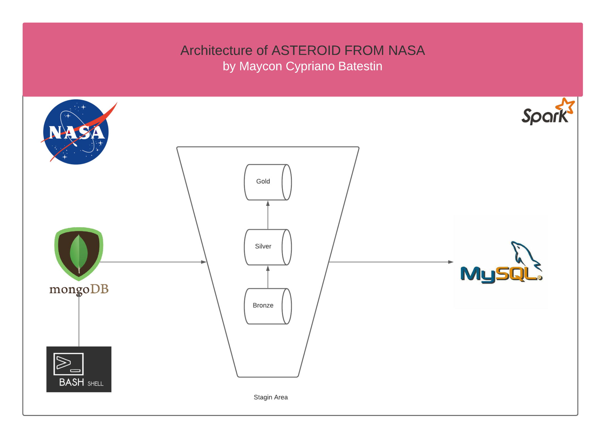
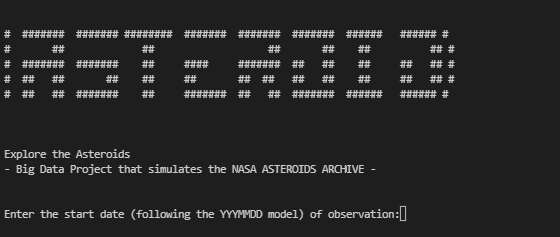

<h1 align="center">


<h3> <p align="center">BIG DATA SIMULATION ASTEROIDS </p> </h3>
<h3> <p align="center"> ================= </p> </h3>

>> <h3> Solution Architecture </h3>




>> <h3> Description </h3>
-------------------------

<p> TIn this project inspired by documents provided by NASA
(you can find this link https://ssd.jpl.nasa.gov/tools/sbdb_query.html#!#results),
we mapped a time of observation of outer space. In this observation data is generated.
The filters we use, in the end, will tell us how many objects in the given period of time were observed,
which of these are asteroids and which are potentially dangerous to Earth.
The architecture is very simple. We create a dataset that will be stored in Mongo Atlas,
we extract the necessary information from there and put it as a repository in Athena AWS.
the end result is something like this: </p>

```
+------------------------------------------------------------------+------+
|metric                                                            |amount|
+------------------------------------------------------------------+------+
|Total Objects that Are Asteroids but pose a danger to Earth       |1320  |
|Total of Objects in Space                                         |6009  |
|Total Objects that Are Asteroids but do not pose a danger to Earth|698   |
+------------------------------------------------------------------+------+

```
-----------------------------

>> <h3> Glossary of Data </h3>
------------------------------
```
SPK-ID: Object primary SPK-ID
Object ID: Object internal database ID
Object fullname: Object full name/designation
pdes: Object primary designation
name: Object IAU name
NEO: Near-Earth Object (NEO) flag
PHA: Potentially Hazardous Asteroid (PHA) flag
H: Absolute magnitude parameter
Diameter: object diameter (from equivalent sphere) km Unit
Albedo: Geometric albedo
Diameter_sigma: 1-sigma uncertainty in object diameter km Unit
Orbit_id: Orbit solution ID
Epoch: Epoch of osculation in modified Julian day form
Equinox: Equinox of reference frame
e: Eccentricity
a: Semi-major axis au Unit
q: perihelion distance au Unit
i: inclination; angle with respect to x-y ecliptic plane
tp: Time of perihelion passage TDB Unit
moid_ld: Earth Minimum Orbit Intersection Distance au Unit

```

>> <h3> Description </h3>
-------------------------

<p> To run the project, you need to install the dependencies located in the "dependencies" folder and in the root of the project, run the shell_script "run_script.sh". </p>




>> <h3> Sample of Payload in MONGO </h3>
-------------------------
> mongo
```
{>> db.asteroid.findOne()
{
        "_id" : ObjectId("61f061aa8a8a61233eac73e2"),
        "spk_id" : 2000002,
        "object_id" : "c0000001",
        "data_of_first_obs" : "20211117",
        "data_of_final_obs" : "20220125",
        "observation days" : 9008,
        "speed" : "853335744m/s",
        "object_fullname" : {
                "fullname" : "2011 CU",
                "prefix" : "2011 ",
                "name" : "DOLMATOVSKIJ"
        },
        "pdes" : 883,
        "diameter_full" : {
                "diameter" : 62.94069199902349,
                "diameter_sigma" : 9.416172
        },
        "h" : 0.7647058823529411,
        "albedo" : 0.5,
        "orbit_id" : "MTU 80",
        "epoch_full" : {
                "epoch" : 9305572,
                "epoch_mjd" : 31301,
                "epoch_cal" : 20220213
        },
        "equinox" : "P9934",
        "om" : 54.45383,
        "e" : 0.6765,
        "a" : 380.226,
        "q" : 591.27968,
        "i" : 57.14826198,
        "w" : 74.373995,
        "ad" : 0.5957,
        "ma" : 73.6536939065,
        "n" : 92,
        "tp_full" : {
                "tp_cal" : 56.12307,
                "tp" : 85.4598039633353
        },
        "per_full" : {
                "per" : 67.6561992216066,
                "per_y" : 64.1
        },
        "sigma_full" : {
                "sigma_e" : "5.21M-48",
                "sigma_a" : "8.53W-73",
                "sigma_q" : "3.53H-95",
                "sigma_i" : "9.42F-20",
                "sigma_om" : "6.13R-55",
                "sigma_w" : "8.46A-57",
                "sigma_ma" : "2.70P-45",
                "sigma_ad" : "6.42S-71",
                "sigma_n" : "5.38F-99",
                "sigma_tp" : "5.47E-78",
                "sigma_per" : "7.88G-66"
        },
        "rms" : 0.250462099,
        "moid_full" : {
                "moid" : 0.9078579715,
                "moid_id" : 37.84697136971
        },
        "class_asteroid" : "S-"
}

```


----------------------------------------------
>> <h3> Sample of Payload in MYSQL </h3>
-------------------------
> 

```
a               |ad             |albedo        |class_asteroid|final_data|start_data|diameter         |diameter_sigma  |e              |epoch    |epoch_mjd|epoch_cal|equinox|h                  |i               |ma               |moid           |moid_id          |n                |fullname|prefix|name          |object_id  |observation_days|om               |orbit_id|pdes|per              |per_y            |q               |rms             |sigma_e |sigma_a |sigma_q |sigma_i |sigma_om|sigma_w |sigma_ma|sigma_ad|sigma_n |sigma_tp|sigma_per|speed       |spk_id |tp_cal           |tp               |w                |neo|pha|process_data|
----------------+---------------+--------------+--------------+----------+----------+-----------------+----------------+---------------+---------+---------+---------+-------+-------------------+----------------+-----------------+---------------+-----------------+-----------------+--------+------+--------------+-----------+----------------+-----------------+--------+----+-----------------+-----------------+----------------+----------------+--------+--------+--------+--------+--------+--------+--------+--------+--------+--------+---------+------------+-------+-----------------+-----------------+-----------------+---+---+------------+
   244232.779833|    0.150907436|          0.77|Other Types   |20220125  |20211117  |            60.43|     1.522410185|   0.8996683539|9343493.0|    28230| 20220203|P4378  | 1.3333333333333333| 939387188038747|             83.0|          0.368|          90.3581|            4.861|2009 ME |2009  |CUPIDO        |a0000002813|observation days|    22.8527215649|KGA 24  | 593|    20.4329617515|            25.78|       7661278.0|         0.73342|1.62T-37|6.90S-47|3.14P-76|2.42B-51|6.13F-44|8.34O-94|6.71R-45|1.80F-41|6.58W-28|2.99A-48|8.78P-69 |788043860m/s|2002814|         7.246052|  48.527669382717|             24.9|No |No |    20220125|
          620.27|            0.8|           0.0|M-types       |20220125  |20211117  |        13.988352|        5.938245|           0.93|7386848.0|    68205| 20220205|N5419  |                2.6|72139354.9050756|             39.0|            0.0|  63.347055124773|      20.62205582|2004 DE |2004  |CARMENCHU     |a0000003272|observation days|    98.8508840826|PLA 80  | 252|             79.0|           80.566|       839202.98|     0.540399907|4.31E-73|4.51B-82|3.82M-98|1.18E-56|1.89S-13|3.33M-73|3.76A-99|8.13C-47|1.78T-57|7.33L-64|1.17B-60 |438861873m/s|2003273|            62.93| 88.4595611535711| 84.2893486534557|No |No |    20220125|
     14.37784739|      0.2542804|    0.53900005|C-            |20220125  |20211117  |     53.632633924|          2.5263|     0.15182002|5825447.0|    66334| 20220223|W9276  |                3.0|68707047729362.7|          52.7606|          0.594|    63.3291375923|      47.57855229|2019 AC |2019  |BOHUSKA       |b0000002366|observation days|           63.357|WAF 91  | 416|             17.0|            47.97|     804344555.6|         0.64826|4.34F-40|4.83S-82|2.54P-65|4.11C-85|1.43S-87|9.69I-21|3.52A-40|3.48L-66|3.72B-96|2.95S-58|5.21G-44 |802341915m/s|2002367|          48.5515| 36.3234254835854|             57.0|No |No |    20220125|
     458192494.4|           0.37|           0.0|C-            |20220125  |20211117  |   87.83173759946|         4.64053|            0.9|5827709.0|    78506| 20220207|C3982  |                1.0|      212354.182|             39.0|            0.3|            71.69| 41.7365243630614|2011 PM |2011  |ERNESTOCORTE  |b0000004826|observation days|           8.5822|FCO 80  | 945| 21.9963774949252|         52.79073|  92250335264981|             0.8|9.35R-14|7.22S-13|3.87D-57|5.49D-43|8.88L-23|5.26O-24|5.46L-44|6.55T-56|1.72A-27|5.19F-21|5.46L-15 |275156931m/s|2004827|   12.89554339653|     60.446879643|        63.463256|No |No |    20220125|
```

>> Resume Infos

```
+------------------------------------------------------------------+------+
|metric                                                            |amount|
+------------------------------------------------------------------+------+
|Total Objects that Are Asteroids but pose a danger to Earth       |1320  |
|Total of Objects in Space                                         |6009  |
|Total Objects that Are Asteroids but do not pose a danger to Earth|698   |
+------------------------------------------------------------------+------+

```