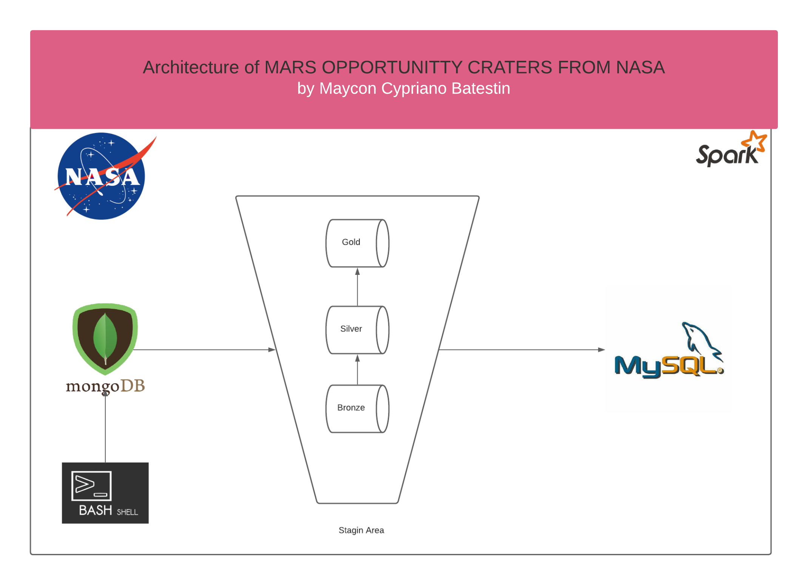

<h1 align="center">


<h3> <p align="center">BIG DATA MARS OPPORTUNITY CRATERS WALKIN AND STUDY </p> </h3>
<h3> <p align="center"> ================= </p> </h3>


>> <h3> Solution Architecture </h3>




>> <h3> Description </h3>
-------------------------

<p> Opportunity was a space probe launched by NASA in 2004 to explore the craters of the Martian planet.
This dataset provided by NASA(https://api.nasa.gov/) aims to extract the data into a relational database,
where through an analysis of SQL queries it will provide metric data such as amount of analyzed data, crater size,
distance traveled and information obtained.
This project is a good training for BIG DATA, the dataset has more than 10 million data.
This dataset is sent to MONGODB where we extract it via PYSPARK. In this next one we perform three alteration layers (bronze, silver and gold)
and we upload it to a relational database, in this case, MYSQL.
Below is a glossary of data.</p>

>> <h3> Glossary of Data </h3>
------------------------------

Fields	                                                  | Type  	  |    Description                              |
----------------------------------------------------------|:---------:|:-------------------------------------------:|
id	                        							  |string 	  | id registration                             |
crater_id												  |string     | Crater identification according to NASA data|
crater_name	  										  	  |string     | Crater name             	                |
latitude            									  |string     | crater latitude                             |
longitude           									  |string     | crater longitude                            |
diam                									  |string     | crater diameter                    |
depth               									  |integer    | crater depth                        |
layers												      |string     | topographic layers of the crater 	            |
morphologys												  |string     | morphologys                       |
yearmonthday     										  |string     | data record date                  |


>> <h3> Description </h3>
-------------------------

<p> To run the project, you need to install the dependencies located in the "dependencies" folder and in the root of the project, run the shell_script "run_script.sh". </p>


>> <h3> Sample of Payload in MONGO </h3>
-------------------------
> mongo
```
{
        "_id" : ObjectId("61f2cfe734dd2e574aa18463"),
        "CRATER_ID" : "01-000003",
        "CRATER_NAME" : "",
        "LATITUDE_CIRCLE_IMAGE" : 70.107,
        "LONGITUDE_CIRCLE_IMAGE" : 160.575,
        "DIAM_CIRCLE_IMAGE" : 74.81,
        "DEPTH_RIMFLOOR_TOPOG" : 0.13,
        "MORPHOLOGY_EJECTA_1" : "",
        "MORPHOLOGY_EJECTA_2" : "",
        "MORPHOLOGY_EJECTA_3" : "",
        "NUMBER_LAYERS" : 0
}

```


----------------------------------------------
>> <h3> Sample of Payload in MYSQL </h3>
-------------------------
> 

```

+---+---------+------------+---------------------+----------------------+-----------------+---------------------+------+-----------+------------+
|id |crater_id|crater_name |latitude_circle_image|longitude_circle_image|diam_circle_image|depth_rim_floor_topog|layers|morphologys|yearmonthday|
+---+---------+------------+---------------------+----------------------+-----------------+---------------------+------+-----------+------------+
|0  |04000087 |Gamboa      |40.768               |-44.348               |30.82            |1.59                 |3     |Rd/MLERS   |20220127    |
|1  |07002655 |Kourou      |46.73                |132.784               |1.7              |0.0                  |0     |0          |20220127    |
|2  |07002853 |Johannesburg|47.919               |133.192               |1.63             |0.0                  |0     |Rd         |20220127    |
|3  |10007707 |New Haven   |22.069               |-49.251               |1.31             |0.0                  |0     |0          |20220127    |
|4  |11000004 |Masursky    |12.067               |-32.305               |115.34           |1.68                 |0     |0          |20220127    |
|5  |14001210 |Pina        |18.366               |111.741               |5.05             |0.33                 |0     |0          |20220127    |
|6  |16001571 |Kibuye      |-29.13               |-178.178              |7.92             |0.69                 |1     |SLEPS      |20220127    |
|7  |18000030 |Mazamba     |-27.532              |-69.673               |52.3             |1.7                  |1     |SLERS      |20220127    |
|8  |19001439 |Manzi       |-22.134              |-27.458               |7.52             |0.91                 |2     |DLEPC      |20220127    |
|9  |26000117 |Zilair      |-31.809              |-32.937               |46.91            |1.16                 |0     |0          |20220127    |
|10 |26000796 |Rengo       |-43.452              |-43.629               |13.7             |0.25                 |0     |0          |20220127    |
|11 |07004082 |Kagoshima   |47.318               |135.731               |1.31             |0.0                  |0     |0          |20220127    |
|12 |10000170 |Balvicar    |16.196               |-53.227               |20.88            |1.17                 |0     |Rd         |20220127    |
|13 |10000277 |Nema        |20.69                |-52.119               |14.54            |0.93                 |1     |SLERS      |20220127    |
|14 |11000017 |Sagan       |10.69                |-30.626               |93.38            |2.72                 |0     |Rd         |20220127    |
|15 |14001218 |Utan        |24.238               |113.812               |5.02             |0.54                 |0     |Rd         |20220127    |
|16 |14002276 |Souris      |19.468               |113.309               |2.93             |0.0                  |0     |0          |20220127    |
|17 |18000024 |Martin      |-21.374              |-69.239               |58.94            |1.59                 |0     |Rd         |20220127    |
|18 |19000458 |Luki        |-29.523              |-37.373               |20.8             |1.41                 |0     |Rd         |20220127    |
|19 |19000808 |Singa       |-22.434              |-17.327               |13.14            |0.33                 |0     |0          |20220127    |
+---+---------+------------+---------------------+----------------------+-----------------+---------------------+------+-----------+------------+
```

>> Resume Infos

```
+-----------------------------+------------------+
|metric                       |amount            |
+-----------------------------+------------------+
|Maximum Distance Traveled(KM)|9.974             |
|Minimum Distance Traveled(KM)|0.024             |
|Total Analyzes Sent          |515               |
|Total Craters Traveled       |985.0             |
|Total Data Collected         |987               |
|Total Walking Distance(KM)   |29583.676000000018|
+-----------------------------+------------------+
```