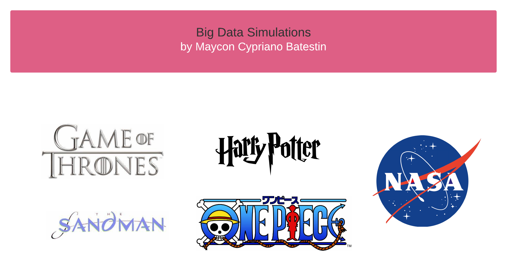

<h1 align="center">

<h3> 
BIG DATA SIMULATION PROJECTS 
 </h3>
<h3> 
 ================= 
 </h3>

>> <h3> PROJECTS </h3>

>> <h3> Description </h3>
-------------------------

 Who says data has to be boring? This repository contains fun, different and creative Big Data projects. These are projects that simulate financial operations, data archiving, population census, academic exams, and exoplanet search.
Each project features a corresponding architecture, both a data engineering architecture and a data schema architecture.
Below is the list of projects

>> <h3> List of Projects </h3>
------------------------------

Projects                                                  | Type  	                    |    Description                                                                                        |
----------------------------------------------------------|:---------------------------:|:-----------------------------------------------------------------------------------------------------:|
Iron Bank Braavos                          				  |Financial Bank 	            | Simulation of what the Braavos iron bank system would be like                                         |
Harry Potter											  |Academic System              | Simulation of what a Hoghwarts World Wizarding Exam would be like                                     |
Nasa Exoplanets								    		  |Scientific System            | Simulation of NASA Exoplanet Exploratory Analysis Archives                                            |
Nasa Asteroids								    		  |Scientific System            | Simulation of NASA Space Observatory in Search of NEO                                            |
One Piece												  |Population Census System     | Simulation of what the ONE PIECE anime population census would be like if it were real                |
Sandman													  |Library File System          | System for controlling books and catalogs from the Library of Dreams from the Sandman literary series |

-------------------------
>> <h3> How to Start </h3>

 To run the project run the shell script "run_script.sh". 

