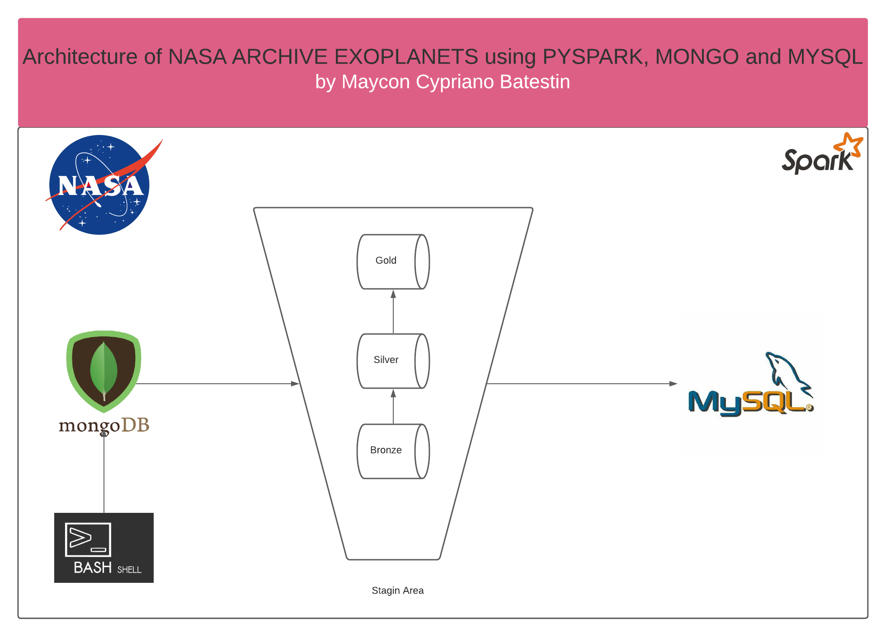
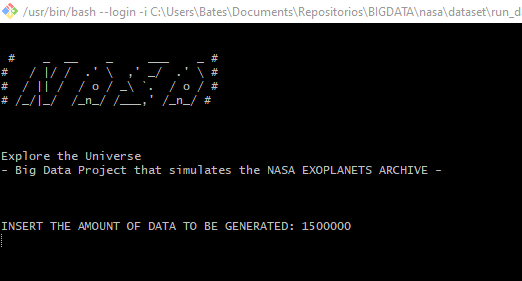

<h1 align="center">


<h3> <p align="center">BIG DATA SIMULATION NASA EXOPLANETS </p> </h3>
<h3> <p align="center"> ================= </p> </h3>

>> <h3> Solution Architecture </h3>




>> <h3> Description </h3>
-------------------------

<p> This project is a private dream when I would like to work at NASA.
This is a project that simulates, with false data, NASA's Exoplanet Archive to find planets outside our solar system. There are a number of characteristics that the star must have in order to be accepted as a Possibly habitable Planet. Below you will have a glossary of the simulated data in this project.
The project consists of routine observation of outer space. Over 24 hours, the data is collected and sent automatically to MONGODB, later, the application extracts the data from this database, treats it in three stages of transformation, and is stored in MYSQL with all the information and a message summarizing the amount of planets that have been confirmed as Candidates for habitable life and the number of planets observed in general.

Below is a glossary of data.</p>

>> <h3> Glossary of Data </h3>
------------------------------
```
Identification Columns
Database Column Name	Table Label	Description
kepid†	Kepler Identification or KepID	Target identification number, as listed in the Kepler Input Catalog (KIC). The KIC was derived from a ground-based imaging survey of the Kepler field conducted prior to launch. The survey's purpose was to identify stars for the Kepler exoplanet survey by magnitude and color. The full catalog of 13 million sources can be searched at the MAST archive. The subset of 4 million targets found upon the Kepler CCDs can be searched via the Kepler Target Search form. The Kepler ID is unique to a target and there is only one Kepler ID per target.
kepoi_name†	KOI Name	A number used to identify and track a Kepler Object of Interest (KOI). A KOI is a target identified by the Kepler Project that displays at least one transit-like sequence within Kepler time-series photometry that appears to be of astrophysical origin and initially consistent with a planetary transit hypothesis. A KOI name has an integer and a decimal part of the format KNNNNN.DD. The integer part designates the target star; the two-digit decimal part identifies a unique transiting object associated with that star. It is not necessarily the planetary candidate listed in that order within a DV report, nor does it indicate the distance of the planet from the the host star relative to other planets in the system.
† Default column: These columns display in the interactive table when the table is first loaded and when Reset Filters is clicked. They are also the default set of columns returned in the API if none are specified. More information about default columns is given in the archive's FAQ.


Exoplanet Archive Information
Database Column Name	Table Label	Description
kepler_name†	Kepler Name	Kepler number name in the form "Kepler-N," plus a lower-case letter, identifying the planet. In general, these numbers are easier to remember than the corresponding KOI or KIC/KepID designations and are intended to clearly indicate a class of objects that have been confirmed or validated as planets—a step up from the planet candidate designation.
koi_disposition†	Exoplanet Archive Disposition	The category of this KOI from the Exoplanet Archive. Current values are CANDIDATE, FALSE POSITIVE, NOT DISPOSITIONED or CONFIRMED. All KOIs marked as CONFIRMED are also listed in the Exoplanet Archive Confirmed Planet table. Designations of CANDIDATE, FALSE POSITIVE, and NOT DISPOSITIONED are taken from the Disposition Using Kepler Data.
koi_vet_stat	Vetting Status	The vetting status for this KOI delivery. Current possible states are ACTIVE and DONE. As vetting tests for the null hypothesis that a TCE is a planet are performed, the disposition of each KOI as either a planet candidate or false positive will be updated and, most importantly, may change over time. It is therefore critical that the scientific community not conduct sample completeness studies on KOI tables that remain ACTIVE. Active tables do, however, provide the latest information for community scientists interested in follow-up observations and disposition activities. After a period of activity, the classification of the KOI table will change from ACTIVE to DONE when all dispositions are judged as final and all model parameters have been updated appropriately. This will typically occur after a new delivery of TCEs to the archive based on a longer data baseline.
koi_vet_date	Date of Last Parameter Update	Date of the last parameter update for this KOI.
† Default column: These columns display in the interactive table when the table is first loaded and when Reset Filters is clicked. They are also the default set of columns returned in the API if none are specified. More information about default columns is given in the archive's FAQ.


Project Disposition Columns
Database Column Name	Table Label	Description	Uncertainties Column
(positive +)
(negative -)	Displayed String Name
koi_pdisposition†	Disposition Using Kepler Data	The pipeline flag that designates the most probable physical explanation of the KOI. Typical values are FALSE POSITIVE, NOT DISPOSITIONED, and CANDIDATE. The value of this flag may change over time as the evaluation of KOIs proceeds to deeper levels of analysis using Kepler time-series pixel and light curve data, or follow-up observations. A not dispositioned value corresponds to objects for which the disposition tests have not yet been completed. A false positive has failed at least one of the tests described in Batalha et al. (2012). A planetary candidate has passed all prior tests conducted to identify false positives, although this does not a priori mean that all possible tests have been conducted. A future test may confirm this KOI as a false positive. False positives can occur when: 1) the KOI is in reality an eclipsing binary star, 2) the Kepler light curve is contaminated by a background eclipsing binary, 3) stellar variability is confused for coherent planetary transits, or 4) instrumental artifacts are confused for coherent planetary transits.	 	 
koi_score†	Disposition Score	A value between 0 and 1 that indicates the confidence in the KOI disposition. For CANDIDATEs, a higher value indicates more confidence in its disposition, while for FALSE POSITIVEs, a higher value indicates less confidence in that disposition. The value is calculated from a Monte Carlo technique such that the score's value is equivalent to the frction of iterations where the Robovetter yields a disposition of CANDIDATE.	 	 
koi_fpflag_nt†	Not Transit-Like Flag	A KOI whose light curve is not consistent with that of a transiting planet. This includes, but is not limited to, instrumental artifacts, non-eclipsing variable stars, and spurious (very low SNR) detections.	 	 
koi_fpflag_ss†	Stellar Eclipse Flag	A KOI that is observed to have a significant secondary event, transit shape, or out-of-eclipse variability, which indicates that the transit-like event is most likely caused by an eclipsing binary. However, self-luminous, hot Jupiters with a visible secondary eclipse will also have this flag set, but with a disposition of PC.	 	 
koi_fpflag_co†	Centroid Offset Flag	The source of the signal is from a nearby star, as inferred by measuring the centroid location of the image both in and out of transit, or by the strength of the transit signal in the target's outer (halo) pixels as compared to the transit signal from the pixels in the optimal (or core) aperture.	 	 
koi_fpflag_ec†	Ephemeris Match Indicates Contamination Flag	The KOI shares the same period and epoch as another object and is judged to be the result of flux contamination in the aperture or electronic crosstalk.	 	 
koi_disp_prov	Disposition Provenance	Disposition Provenance	 	 
koi_comment	KOI Comment	A description of the reason why an object's disposition has been given as false positive. The following keywords are shorthand for certain criterion used to determine if a KOI is a false positive:
APO: "Active Pixel Offset" The pixels showing the transit do not coincide with the target star, indicating that the transit is actually on a background object.
Binary: Indicates the transit event is due to an eclipsing binary, not a planet.
EB: Target is an eclipsing binary, or there is an unresolved background binary.
odd-even: The depth of the even-numbered transits are statistically different than the depths of the odd-numbered transits; this is a sign of a background eclipsing binary.
V-shaped: Likely a grazing eclipsing binary.
SB1: Target star is a single-lined spectroscopic binary.
SB2: Target star is a double-lined spectroscopic binary.
A comment field may also contain a list of the minor flags as set by the Robovetter. See the documents for the DR 25 and DR 24 Robovetter KOI Flags for detailed descriptions.

 	 
† Default column: These columns display in the interactive table when the table is first loaded and when Reset Filters is clicked. They are also the default set of columns returned in the API if none are specified. More information about default columns is given in the archive's FAQ.


Transit Properties
Transit parameters delivered by the Kepler Project are typically best-fit parameters produced by a Mandel-Agol (2002) fit to a multi-quarter Kepler light curve, assuming a linear orbital ephemeris. Some of the parameters listed below are fit directly, other are derived from the best-fit parameters. Limb-darkening coefficients are fixed and pre-calculated from host star properties. Orbital Period, Transit Epoch, Planet-Star Radius Ratio, Planet-Star Distance over Star Radius and Impact Parameter are the free parameters in the fit. Matrix covariances are adopted as errors to the fit parameters; they therefore ignore the effects of correlation between the fit parameters and are likely to be underestimates.

See the links in the Purpose of KOI document for each activity table for more details on the fits for each delivery.

Scaled planetary parameters combine the dimensionless fit parameters with physical stellar parameters to produce planet characteristics in physical units.

Best-fit planetary transit parameters are typically normalized to the size of the host star. Physical planet parameters may be derived by scaling to the star's size and temperature. Transit parameters also depend weakly upon the limb-darkening coefficients which are derived from the stellar parameters (e.g., Claret and Bloemen 2011).

Database Column Name	Table Label	Description	Uncertainties Column
(positive +)
(negative -)	Displayed String Name
koi_period†	Orbital Period (days)	The interval between consecutive planetary transits.	koi_period_err1, koi_period_err2	koi_period_str
koi_time0bk†	Transit Epoch (BJD - 2,454,833.0)	The time corresponding to the center of the first detected transit in Barycentric Julian Day (BJD) minus a constant offset of 2,454,833.0 days. The offset corresponds to 12:00 on Jan 1, 2009 UTC.	koi_time0bk_err1, koi_time0bk_err2	koi_time0bk_str
koi_time0	Transit Epoch in BJD	The time corresponding to the center of the first detected transit in Barycentric Julian Day (BJD).	koi_time0_err1, koi_time0_err2	koi_time0_str
koi_eccen	Eccentricity	Eccentricity Value	koi_eccen_err1, koi_eccen_err2	koi_eccen_str
koi_longp	Long. of Periastron (deg)	Longitude of Periastron	koi_longp_err1, koi_longp_err2	koi_longp_str
koi_impact†	Impact Parameter	The sky-projected distance between the center of the stellar disc and the center of the planet disc at conjunction, normalized by the stellar radius.	koi_impact_err1, koi_impact_err2	koi_impact_str
koi_duration†	Transit Duration (hours)	The duration of the observed transits. Duration is measured from first contact between the planet and star until last contact. Contact times are typically computed from a best-fit model produced by a Mandel-Agol (2002) model fit to a multi-quarter Kepler light curve, assuming a linear orbital ephemeris.	koi_duration_err1, koi_duration_err2	koi_duration_str
koi_ingress†	Ingress Duration (hours)	The time between first and second contact of the planetary transit. Contact times are typically computed from a best-fit model produced by a Mandel-Agol (2002) model fit to a multi-quarter Kepler light curve, assuming a linear orbital ephemeris.	koi_ingress_err1, koi_ingress_err2	koi_ingress_str
koi_depth†	Transit Depth (parts per million)	The fraction of stellar flux lost at the minimum of the planetary transit. Transit depths are typically computed from a best-fit model produced by a Mandel-Agol (2002) model fit to a multi-quarter Kepler light curve, assuming a linear orbital ephemeris.	koi_depth_err1, koi_depth_err2	koi_depth_str
koi_ror	Planet-Star Radius Ratio	The planet radius divided by the stellar radius.	koi_ror_err1, koi_ror_err2	koi_ror_str
koi_srho	Fitted Stellar Density [g/cm*3]	Fitted stellar density is a direct observable from the light curve that, in the small-planet approximation, depends only on the transit's period, depth, and duration (see Seager and Mallen-Ornelas 2003). This quantity is directly fitted in the LS and MCMC methods, and is completely independent from the listed stellar mass and radius, which are derived using ground-based photometry, spectroscopy, and other observations.	koi_srho_err1, koi_srho_err2	koi_srho_str
koi_fittype	Planetary Fit Type	Type of Fit for planetary parameters. Options are:
LS (Least Squares fit)
MCMC (Markov Chain Monte Carlo fit)
DV (Data Validation pipeline fit)
none (fit is not provided, only orbital period, transit epoch and transit duration are reported)
LS+MCMC (Least Squares Fit with Markov Monte Carlo error bars)
 	 
koi_prad†	Planetary Radius (Earth radii)	The radius of the planet. Planetary radius is the product of the planet star radius ratio and the stellar radius.	koi_prad_err1, koi_prad_err2	koi_prad_str
koi_sma	Orbit Semi-Major Axis (Astronomical Unit (au))	Half of the long axis of the ellipse defining a planet's orbit. For a circular orbit this is the planet-star separation radius. The semi-major axis is derived based on Kepler's third law, i.e., utilizing the orbital period and stellar mass, not scaling the planet-star separation by the stellar radius.	koi_sma_err1, koi_sma_err2	koi_sma_str
koi_incl	Inclination (deg)	The angle between the plane of the sky (perpendicular to the line of sight) and the orbital plane of the planet candidate.	koi_incl_err1, koi_incl_err2	koi_incl_str
koi_teq†	Equilibrium Temperature (Kelvin)	Approximation for the temperature of the planet. The calculation of equilibrium temperature assumes a) thermodynamic equilibrium between the incident stellar flux and the radiated heat from the planet, b) a Bond albedo (the fraction of total power incident upon the planet scattered back into space) of 0.3, c) the planet and star are blackbodies, and d) the heat is evenly distributed between the day and night sides of the planet.	koi_teq_err1, koi_teq_err2	koi_teq_str
koi_insol†	Insolation Flux [Earth flux]	Insolation flux is another way to give the equilibrium temperature. It depends on the stellar parameters (specifically the stellar radius and temperature), and on the semi-major axis of the planet. It's given in units relative to those measured for the Earth from the Sun.	 	 
koi_dor	Planet-Star Distance over Star Radius	The distance between the planet and the star at mid-transit divided by the stellar radius. For the case of zero orbital eccentricity, the distance at mid-transit is the semi-major axis of the planetary orbit.	koi_dor_err1, koi_dor_err2	koi_dor_str
koi_limbdark_mod	Limb Darkening Model Name	A reference to the limb-darkening model used to calculate stellar limb-darkening coefficients.	 	 
koi_ldm_coeff1, koi_ldm_coeff2, koi_ldm_coeff3, koi_ldm_coeff4	Limb Darkening Coefficients	Up to four coefficients (a1, a2, a3, a4) that define stellar limb darkening (e.g., Claret 2000). Limb darkening is the variation of specific intensity of the star as a function of μ = cos(θ). θ is the angle between the line-of-sight of an observer and a line perpendicular to the stellar surface at an observed point. Coefficients are dependent upon stellar temperature, surface gravity and metallicity. Adopted coefficients are required input for Mandel-Agol (2002) fits and are extracted from archived tables (e.g., Claret and Bloemen 2011). Limb-darkening coefficients remain fixed during fit minimization. Note that the dependence of limb-darkening coefficients on stellar parameters implies that planet radius does not scale linearly with stellar radius. If new stellar parameters are adopted, the most-correct approach is to re-fit the transit with new limb-darkening coefficients in order to re-measure planet size.	 	 
koi_parm_prov	KOI Parameter Provenance	KOI Parameter Provenance	 	 
† Default column: These columns display in the interactive table when the table is first loaded and when Reset Filters is clicked. They are also the default set of columns returned in the API if none are specified. More information about default columns is given in the archive's FAQ.


Threshold-Crossing Event (TCE) Information
The Transiting Planet Search (TPS) module of the Kepler data analysis pipeline performs a detection test for planet transits in the multi-quarter, gap-filled flux time series. The TPS module detrends each quarterly PDC light curve to remove edge effects around data gaps and then combines the data segments together, filling gaps with interpolated data so as to condition the flux time series for a matched filter. The module applies an adaptive, wavelet-based matched filter (Jenkins 2002, Jenkins et al. 2010 and Tenenbaum et al. (2012)) to perform a joint characterization of observation noise and detection of transit-like features in the light curve.

The TPS module estimates the Power Spectral Density of the flux time series as a function in time. This provides coefficients for a whitening filter to accommodate non-stationary, non-white noise and yields Single Event Statistic (SES) time series components. These can be interpreted as measurements of the statistical significance of the presence of a transit of trial duration at each point in the time series.

Single Event Statistics are folded at each trial orbital period and the maximum Multiple Event Statistic (MES) is obtained over all trial periods and phases. The MES estimates the signal to noise ratio of the putative transit-like sequence against the measurement noise. The MES threshold for defining the sample of Threshold Crossing Events (TCEs) is provided within the Release Notes. For reference, a lower MES threshold of 7.1σ limits the number of false positives in the TCE sample due to statistical random noise to less than 1 over the primary mission (Jenkins, Caldwell and Borucki 2002).

Database Column Name	Table Label	Description
koi_max_sngle_ev	Maximum Single Event Statistic	The maximum calculated value of the SES. Maximum SES statistics for different TCEs from the same target differ because the most significant TCE is removed from the time series before repeating the test for further, weaker transit signals.
koi_max_mult_ev	Maximum Multiple Event Statistic	The maximum calculated value of the MES. TCEs that meet the maximum MES threshold criterion and other criteria listed in the TCE release notes are delivered to the Data Validation (DV) module of the Kepler data analysis pipeline for transit characterization and the calculation of statistics required for disposition. A TCE exceeding the maximum MES threshold are removed from the time-series data and the SES and MES statistics recalculated. If a second TCE exceeds the maximum MES threshold then it is also propagated through the DV module and the cycle is iterated until no more events exceed the criteria. Candidate multi-planet systems are thus found this way. Users of the TCE table can exploit the maximum MES statistic to help filter and sort samples of TCEs for the purposes of discerning the event quality, determining the likelihood of planet candidacy, or assessing the risks of observational follow-up.
koi_model_snr†	Transit Signal-to-Noise	Transit depth normalized by the mean uncertainty in the flux during the transits.
koi_count	Number of Planets	Number of planet candidates identified in a system.
koi_num_transits	Number of Transits	The number of expected transits or partially-observed transits associated with the planet candidate occurring within the searched light curve. This does not include that fall completely within data gaps.
koi_tce_plnt_num†	TCE Planet Number	TCE Planet Number federated to the KOI.
koi_tce_delivname†	TCE Delivery Name	TCE delivery name corresponding to the TCE data federated to the KOI.
koi_quarters	Quarters	A bit string indicating which quarters of Kepler data were searched for transit signatures. Reading from left to right, the bits indicate the quarters, starting with quarter 1. A value of 1 for any bit means the designated quarter was searched for transits; a value of 0 means that quarter was not included in the transit search.
koi_trans_mod	Transit Model Name	A reference to the transit model used to fit the data (e.g., Mandel-Agol 2002).
koi_model_dof	Model Degrees of Freedom (DOF)	The number of degrees of freedom used when fitting the transit model to the data.
koi_model_chisq	Model Goodness of Fit	The goodness of the transit fit to the data. Within the TCE table, this quantity is the χ2 statistic. Within the KOI table this quantity is the reduced-χ2 statistic, e.g., divided by the number of degrees of freedom in the fit.
koi_datalink_dvr	Link to DV Report	This is the relative path for the data validation report; use it when retrieving individual reports through the archive's application programming interface with wget. You must append the following URL to the file name in your wget query:
http://exoplanetarchive.ipac.caltech.edu/data/KeplerData/
koi_datalink_dvs	Link to DV Summary	This is the relative path for the data validation summary; use it when retrieving individual reports through the archive's application programming interface with wget. You must append the following URL to the file name in your wget query:
http://exoplanetarchive.ipac.caltech.edu/data/KeplerData/
† Default column: These columns display in the interactive table when the table is first loaded and when Reset Filters is clicked. They are also the default set of columns returned in the API if none are specified. More information about default columns is given in the archive's FAQ.


Stellar Parameters
Stellar effective temperature, surface gravity, metallicity, radius, mass, and age should comprise a consistent set. Associated error estimates are 1-σ uncertainties.

Database Column Name	Table Label	Description	Uncertainties Column
(positive +)
(negative -)	Displayed String Name
koi_steff†	Stellar Effective Temperature (Kelvin)	The photospheric temperature of the star.	koi_steff_err1, koi_steff_err2	koi_steff_str
koi_slogg†	Stellar Surface Gravity (log10(cm s-2)	The base-10 logarithm of the acceleration due to gravity at the surface of the star.	koi_slogg_err1, koi_slogg_err2	koi_slogg_str
koi_smet	Stellar Metallicity	The base-10 logarithm of the Fe to H ratio at the surface of the star, normalized by the solar Fe to H ratio	koi_smet_err1, koi_smet_err2	koi_smet_str
koi_srad†	Stellar Radius (solar radii)	The photospheric radius of the star	koi_srad_err1, koi_srad_err2	koi_srad_str
koi_smass	Stellar Mass (solar mass)	The mass of the star	koi_smass_err1, koi_smass_err2	koi_smass_str
koi_sage	Stellar Age (Gigayears)	The age of the star	koi_sage_err1, koi_sage_err2	koi_sage_str
koi_sparprov	Provenance of Stellar Parameters	A flag describing the source of the stellar parameters.
KIC = The parameters are extracted from the Kepler Input Catalog (Brown et al. 2011). Uncertainties of Teff = 200 K, log(g) = 0.3 dex and [Fe/H] = 0.4.

J-K = The star is unclassified in the KIC, J-K has been used to estimate temperature. The host star is assumed to be on the ZAMS with corresponding log(g) based on the Schmidt-Kaler relation.

Solar = The star is unclassified in the KIC, so the host star is assumed to have solar properties.

SME = Spectroscopic parameters derived from SME analysis (Valenti and Piskunov 1996). Stellar parameters are derived based on stellar evolution models.

SPC = Spectroscopic parameters derived from SPC analysis (Buchhave et al. 2012). Stellar parameters are derived based on stellar evolution models.

Pinsonneault = Uses a revised Teff scale from Pinsonneault et al. (2012) with [Fe/H] fixed at -0.2. The quantity log(g) is taken from the KIC. Values are then revised by fitting to Yonsei-Yale stellar evolution models (Yi et al. 2001).

Astero = Host star properties have been measured by comparison with astroseismologial models.

 	 
† Default column: These columns display in the interactive table when the table is first loaded and when Reset Filters is clicked. They are also the default set of columns returned in the API if none are specified. More information about default columns is given in the archive's FAQ.


KIC Parameters
Database Column Name	Table Label	Description	Uncertainties Column
(positive +)
(negative -)	Displayed String Name
ra†	RA (deg)	KIC Right Ascension	ra_err	 
dec†	Dec (deg)	KIC Declination	dec_err	 
koi_kepmag†	Kepler-band (mag)	Kepler-band (mag)	koi_kepmag_err	koi_kepmag_str
koi_gmag	KIC g'-band mag	g'-band mag from KIC	koi_gmag_err	koi_gmag_str
koi_rmag	KIC r'-band mag	r'-band mag from KIC	koi_rmag_err	koi_rmag_str
koi_imag	KIC i'-band mag	i'-band mag from KIC	koi_imag_err	koi_imag_str
koi_zmag	KIC z'-band mag	z'-band mag from KIC	koi_zmag_err	koi_zmag_str
koi_jmag	KIC J-band mag	J-band mag from 2MASS	koi_jmag_err	koi_jmag_str
koi_hmag	KIC H-band mag	H-band mag from 2MASS	koi_hmag_err	koi_hmag_str
koi_kmag	KIC K-band mag	K-band mag from 2MASS	koi_kmag_err	koi_kmag_str
† Default column: These columns display in the interactive table when the table is first loaded and when Reset Filters is clicked. They are also the default set of columns returned in the API if none are specified. More information about default columns is given in the archive's FAQ.


Pixel-Based KOI Vetting Statistics
Planetary transit false positives are commonly caused by light curve contamination from an eclipsing binary falling partially within the target aperture (i.e., the pixels used to collect and sum target flux). Two pixel analysis methods are used to identify such eclipsing binaries for unsaturated target stars: flux-weighted centroiding, which measures how the center of light in the collected pixels changes during a transit, and PRF-fit difference images, which localize the source of the transit signal. Both methods provide an estimate of the location of the source of the transit signal. When that source location is offset from the target star by more than 3-σ, it is likely the transit signal is due to a background source (note the caveats due to crowding described below). These analysis techniques use pixel-level data, available in the Target Pixel Files (TPFs). The resulting position measurements are compared with the Kepler Input Catalog (KIC) (Brown et al. 2011). Details on these centroid methods are found in Bryson et. al. 2013.

When the target star is saturated (Kepler magnitude larger than about 11.5) the centroid results given in this section are invalid. In this case manual inspection of the data validation reports can identify well-offset background binaries—see Section 5 of Bryson et. al. 2013 for details.

In flux-weighted centroid analysis, when more than one source is present within a pixel aperture, either fully or partially, then the combined center of light within the collected pixels will occur between the locations of the sources. When the flux from either the target or one of the nearby contaminants varies in a transit or eclipse, then the combined center of light within the aperture will move across the focal plane. This motion is called a centroid shift. The location of the varying source can often be inferred from the centroid shift. The size and direction of the centroid shift is measured using the flux-weighted (FW) mean, (e.g., the first moment of the pixel data). This mean is computed with every flux measurement (30-minute long cadence), creating a time series of flux-weighted means. The centroid shift is measured by comparing portions of the flux-weighted mean time series that are Out-Of-Transit (OOT) with portions that are In-Transit (IT). The flux-weighted shift of the IT mean from the OOT mean is given as Right Ascension and Declination shifts. The offset of the transiting source object from the OOT flux-weighted mean is computed by taking the product of the FW shift and the factor [1 - 1 / (fractional transit depth)]. The Right Ascension, α (J2000), and Declination, δ (J2000), of the transiting object calculated in this way are reported in the table. The α and δ offsets of the resulting source location from the KIC target star position are also reported. The uncertainties and significance of the FW shifts and offsets are provided but do not reflect systematics caused by crowding. The flux-weighted method can be very accurate when the target star is well isolated and the transit source is located (well) within the flux aperture associated with the target star.

The PRF-fit difference image method uses three images: 1) an average of Out-Of-Transit (OOT) Target Pixel File images from data that were obtained near but not during transit events, 2) an average of In-Transit (IT) image Target Pixel File images that were collected during transit events, and 3) a Difference Image (DIFF) that is the difference between the Out-Of-Transit and In-Transit average images. The difference image provides an image of the transit source (neglecting variability of field stars). The Pixel Response Function (PRF) is a convolution of the Kepler Point Spread Function model with a model of typical spacecraft pointing jitter, providing a system point spread function (Bryson et al. 2010). The PRF is fit separately to the OOT and DIFF images, providing a measured location of the target star (fit to the OOT image) and a measured location of the transit source (fit to the DIFF image). The offset of the transit source location from the target star is given in the table as Right Ascension and Declination offsets (Δα,Δδ) as well as magnitude (sky offset Δθ).

PRF offsets can only be computed on a per-quarter basis. The single quarter (SQ) PRF offsets are combined by a weighted mean.

The target position measured by the PRF fit to the OOT images is vulnerable to crowding. Therefore an alternative PRF offset of the transit source (measured by the PRF fit to the DIFF image) from the KIC position of the target star is provided. Both the flux-weighted and PRF-fit methods will have systematic errors due to crowding when other stars appear in the aperture's pixels, though these error are smaller for the PRF-fit method compared to the flux-weighted method.

The associated error estimates are 1-σ uncertainties.

Database Column Name	Table Label	Description	Uncertainties Column
(positive +)
(negative -)	Displayed String Name
koi_fwm_sra	FW Sourceα(OOT)
units: hours	The Right Ascension (J2000) of the location of the transiting object calculated from the flux-weighted centroids. This result does not reflect the systematics due to crowding which can introduce significant errors in the calculated position.	koi_fwm_sra_err	koi_fwm_sra_str
koi_fwm_sdec	FW Source δ(OOT)
units: degrees	The Declination (J2000) of the location of the transiting object calculated from the flux-weighted centroids. This result does not reflect the systematics due to crowding which can introduce significant errors in the calculated position.	koi_fwm_sdec_err	koi_fwm_sdec_str
koi_fwm_srao	FW Δα(OOT)
units: seconds (not arcseconds)	The RA (J2000) flux-weighted centroid shift. This is the RA of the in-transit flux weighted centroid minus the RA of the out-of-transit flux weighted centroid.	koi_fwm_srao_err	koi_fwm_srao_str
koi_fwm_sdeco	FW Δδ(OOT)
units: arcseconds	The Dec (J2000) flux-weighted centroid shift. This is the Dec of the in-transit flux weighted centroid minus the Dec of the out-of-transit flux weighted centroid.	koi_fwm_sdeco_err	koi_fwm_sdeco_str
koi_fwm_prao	FW Source Δα(OOT)
units: seconds (not arcseconds)	The calculated Right Ascension offset of the transiting or eclipsing object from the KIC location of the target star. The accuracy of this calculation degrades when the transit source has significant flux that falls outside the photometric aperture + a halo of pixels around it.	koi_fwm_prao_err	koi_fwm_prao_str
koi_fwm_pdeco	FW Source Δδ(OOT)
units: arcseconds	The calculated Declination offset of the transiting or eclipsing object from the KIC location of the target star. The accuracy of this calculation degrades when the transit source has significant flux that falls outside the photometric aperture + a halo of pixels around it.	koi_fwm_pdeco_err	koi_fwm_pdeco_str
koi_fwm_stat_sig	Flux-Weighted Offset Significance (percent)	Indicates whether there is a statistically significant flux-weighted offset between in-transit and out-of-transit images. 100% indicates there is no offset and there is confidence that the transit is on the target star. The accuracy of this calculation degrades when the transit source has significant flux that falls outside the photometric aperture + a halo of pixels around it.		koi_fwm_stat_sig_str
koi_dicco_mra	PRF ΔαSQ(OOT)
units: arcseconds	The angular offset in the RA (J2000) direction between the best-fit PRF centroids from the Out-Of-Transit image and the Difference Image by averaging the weighted single-quarter measurements. The out-of-transit centroids are subtracted from the difference image centroids.	koi_dicco_mra_err	koi_dicco_mra_str
koi_dicco_mdec	PRF ΔδSQ(OOT)
units: arcseconds	The angular offset in the Dec (J2000) direction between the best-fit PRF centroids from the Out-Of-Transit image and the Difference Image by averaging the weighted single-quarter measurements. The out-of-transit centroids are subtracted from the difference image centroids.	koi_dicco_mdec_err	koi_dicco_mdec_str
koi_dicco_msky	PRF ΔθSQ(OOT)
units: arcseconds	The angular offset on the plane of the sky between the best-fit PRF centroids from the Out-Of-Transit image and the Difference Image by averaging the weighted single-quarter measurements. The out-of-transit centroids are subtracted from the difference image centroids.	koi_dicco_msky_err	koi_dicco_msky_str
koi_dikco_mra	PRF ΔαSQ(KIC)
units: arcseconds	The angular offset in the RA (J2000) direction between the best-fit PRF centroids from the difference image and the Kepler Input Catalog position by averaging the weighted single-quarter measurements. The KIC position is subtracted from the difference image centroids.	koi_dikco_mra_err	koi_dikco_mra_str
koi_dikco_mdec	PRF ΔδSQ(KIC)
units: arcseconds	The angular offset in the Dec (J2000) direction between the best-fit PRF centroids from the difference image and the Kepler Input Catalog position by averaging the weighted single-quarter measurements. The KIC position is subtracted from the difference image centroids.	koi_dikco_mdec_err	koi_dikco_mdec_str
koi_dikco_msky	PRF ΔθSQ(KIC)
units: arcseconds	The angular offset in the plane of the sky between the best-fit PRF centroids from the difference image and the Kepler Input Catalog position by averaging the weighted single-quarter measurements. The KIC position is subtracted from the difference image centroids.	koi_dikco_msky_err	koi_dikco_msky_str
Last updated: 11 February 2021

```

>> <h3> Description </h3>
-------------------------

<p> To run the project, you need to install the dependencies located in the "dependencies" folder and in the root of the project, run the shell_script "run_script.sh". </p>




>> <h3> Sample of Payload in MONGO </h3>
-------------------------
> mongo
```
{> db.archive.findOne()
{
        "_id" : ObjectId("61c0f0f9b1c91f78deeff92b"),
        "identification" : {
                "keipID" : 663335308,
                "koi_name" : "K000111.04"
        },
        "exoplanet_information" : {
                "kepler_name" : "Kepler-1236 b",
                "exoplanet_disposition" : "CONFIRMED",
                "vetting_status" : "done",
                "date_of_last_parameter_update" : "2021-08-28"
        },
        "project_disposition" : {
                "disposition_using_kepler_data" : "CANDIDATE",
                "disposition_score" : 5,
                "not_transit_like_false_positive_flag" : 0,
                "stellar_eclipse_false_positive_flag" : 0,
                "centroid_offset_false_positive_flag" : 755.10861533633,
                "ephemeris_math_indicates_contamination_false_positive_flag" : 0,
                "disposition_provenance" : "q4_q76_dr19_tcm"
        },
        "transit_properties" : {
                "orbital_period" : {
                        "orbital_period_days" : 9722357971900,
                        "orbital_period_upper_unc_days" : "9.2000-e06",
                        "orbital_period_lower_unc_days" : "-9.2000-e06"
                },
                "transit_epoch_bkjd" : {
                        "transit_epoch_bkjd" : 22158115,
                        "transit_epoch_upper_unc_bkjd" : "1.7000-e04",
                        "transit_epoch_lower_unc_bkjd" : "-1.7000-e04"
                },
                "transit_epoch_bjd" : {
                        "transit_epoch_bjd" : 3458584.55369,
                        "transit_epoch_upper_unc_bjd" : "8.9000-e01",
                        "transit_epoch_lower_unc_bjd" : "-8.9000-e01"
                },
                "eccentricity" : {
                        "eccentricity" : 1,
                        "eccentricity_upper_unc" : "1",
                        "eccentricity_lower_unc" : "-1"
                },
                "long_periastron" : {
                        "long_periastron_deg" : 1,
                        "long_periastron_upper_unc_deg" : "1",
                        "long_periastron_lower_unc_deg" : "-1"
                },
                "impact_parameter" : {
                        "impact_parameter" : 733935751974321,
                        "impact_parameter_upper_unc" : 8.7,
                        "impact_parameter_lower_unc" : -8.7
                },
                "transit_duration" : {
                        "transit_duration_hrs" : 25586568262504,
                        "transit_duration_upper_unc_hrs" : 3.3,
                        "transit_duration_lower_unc_hrs" : -3.3
                },
                "ingress_duration" : {
                        "ingress_duration_hrs" : 444682246499817,
                        "ingress_duration_upper_unc" : 6.6,
                        "ingress_duration_lower_unc" : -6.6
                },
                "transit_depth" : {
                        "transit_depth_ppm" : 3559,
                        "transit_depth_upper_unc_ppm" : 95,
                        "transit_depth_lower_unc_ppm" : -95
                },
                "planet_star_radius_ratio" : {
                        "planet_star_radios_ratio" : 8431569245.187,
                        "planet_star_radius_ratio_upper_unc" : "5.6000-e09",
                        "planet_star_radius_ratio_lower_unc" : "-5.6000-e09"
                },
                "fitted_stellar_density" : {
                        "fitted_stellar_density" : 60366527993.98,
                        "fitted_stellar_density_upper_unc_gcm3" : "3.3000-e01",
                        "fitted_stellar_density_lower_unc_gcm3" : "-3.3000-e01"
                },
                "planetary_fit_type" : 967729466173757,
                "planetary_radius" : {
                        "planetary_radius_earth_radii" : 4946.87,
                        "planetary_radius_upper_unc_earth_raddi" : 1291.18474550301,
                        "planetary_radius_lower_unc_earth_raddi" : -1291.18474550301
                },
                "orbit_semi_major_axis" : {
                        "orbit_semi_major_axis_au" : 504294893.9489,
                        "orbit_semi_major_axis_upper_unc_au" : 432162718432175,
                        "orbit_semi_major_axis_lower_unc_au" : -432162718432175
                },
                "inclination" : {
                        "inclination_deg" : 55213.386748075,
                        "inclination_upper_unc_deg" : 716905179024130,
                        "inclination_lower_unc_deg" : -716905179024130
                },
                "equilibrium_temperature" : {
                        "equilibrium_temperature_k" : 8802749906552.57,
                        "equilibrium_temperature_upper_unc_k" : 409970.32167522,
                        "equilibrium_temperature_lower_unc_k" : -409970.32167522
                },
                "isolotaion_flux" : {
                        "isolation_flux" : 9691331412.303,
                        "isolotaion_flux_upper_unc" : 3621136221470.6,
                        "isolation_flux_lower_unc" : -3621136221470.6
                },
                "planet_star_distance_over_star_radius" : {
                        "planet_star_distance_over_star_radius" : 28.508,
                        "planet_star_distance_over_star_radius_upper" : "5.8000-e04",
                        "planet_star_distance_over_star_radius_lower" : "-5.8000-e04"
                },
                "limb_darkening_model" : "Claret(2017 Q&B 544 61) ATLAS LT",
                "limb_darkening_coeff_4" : 1006427688260,
                "limb_darkening_coeff_3" : 622.9757,
                "limb_darkening_coeff_2" : 59625359631999,
                "limb_darkening_coeff_1" : 29028.96,
                "parameters_provenance" : "q4_q25_kepler"
        },
        "threshold_corssing_event_information" : {
                "maximum_single_event_statistic" : 8150473561283,
                "maximum_multiple_event_statistic" : 5546.5956556,
                "transit_signal_to_noise" : 6.886582,
                "number_of_planets" : 16,
                "number_of_transits" : 9,
                "tce_planet_number" : 2,
                "tce_delivery" : "q3_q41_tce",
                "quarters" : 310.688143,
                "odd_even_depth_comparision_statistic" : 2451985190785.2,
                "transit_model" : "Mandel and Agol (2018 DlT 373 392)",
                "degress_of_freedom" : 416125786.6577,
                "chi_square" : 1815918,
                "link_to_dv_report" : "https://www.lorempixel.com/448/120",
                "link_to_dv_summary" : "https://dummyimage.com/878x411"
        },
        "stellar_paramenters" : {
                "stellar_effective_temperature_k" : {
                        "stellar_effective_temperature_k" : 812015018.6693,
                        "stellar_effective_temperature_upper_unc_k" : 217.93,
                        "stellar_effective_temperature_lower_unc_k" : 665.9581773411
                },
                "stellar_surface_gravity" : {
                        "stellar_surface_gravity" : 49.468694,
                        "stellar_surface_gravity_upper_unc" : 258617083806.27,
                        "stellar_surface_gravity_lower_unc" : 24084317825.104
                },
                "stellar_metallicity" : {
                        "stellar_metallicity_dex" : 848625.94532,
                        "stellar_metallicity_upper_unc" : -578621.8087351,
                        "stellar_metallicity_lower_unc" : -4468314634094
                },
                "stellar_radius" : {
                        "stellar_radius_solar_raddi" : 1243896651.57649,
                        "stellar_radius_upper_unc_solar_raddi" : 89747,
                        "stellar_radius_lower_unc_solar_raddi" : 49035431458055
                },
                "stellar_mass" : {
                        "stellar_mass_solar_mass" : 51981704.7289098,
                        "stellar_mass_upper_unc_solar_mass" : 7699,
                        "stellar_mass_lower_unc_solar_mass" : 441.93337892
                },
                "stellar_age" : {
                        "stellar_age_gyr" : 90121998259970,
                        "stellar_age_upper_unc_gyr" : 400320754,
                        "stellar_age_lower_unc_gyr" : 4171.88
                }
        },
        "stellar_parameter_provenance" : "stellar_q3_q74",
        "kic_parameters" : {
                "ra" : 3.1709,
                "dec" : 7252.5,
                "kepler_band" : 28185089099.9011,
                "g_band" : 67749,
                "r_band" : 3.6203773,
                "i_band" : 83880840033.5,
                "z_band" : 219065639.6,
                "j_band" : 5280636782.6951,
                "h_band" : 3310378.341,
                "k_band" : 82.55045652549
        }
}

```


----------------------------------------------
>> <h3> Sample of Payload in MYSQL </h3>
-------------------------
> 

```
keipID   |koi_name  |kepler_name  |exoplanet_disposition|vetting_status|date_of_last_parameter_update|disposition_using_kepler_data|disposition_score|not_transit_like_false_positive_flag|stellar_eclipse_false_positive_flag|centroid_offset_false_positive_flag|ephemeris_math_indicates_contamination_false_positive_flag|disposition_provenance|orbital_period_days|orbital_period_upper_unc_days|orbital_period_lower_unc_days|transit_epoch_bkjd |transit_epoch_upper_unc_bkjd|transit_epoch_lower_unc_bkjd|transit_epoch_bjd  |transit_epoch_upper_unc_bjd|transit_epoch_lower_unc_bjd|eccentricity|eccentricity_upper_unc|eccentricity_lower_unc|long_periastron_deg|long_periastron_upper_unc_deg|long_periastron_lower_unc_deg|impact_parameter   |impact_parameter_upper_unc|impact_parameter_lower_unc|transit_duration_hrs|transit_duration_upper_unc_hrs|transit_duration_lower_unc_hrs|ingress_duration_hrs|ingress_duration_upper_unc|ingress_duration_lower_unc|transit_depth_ppm|transit_depth_upper_unc_ppm|transit_depth_lower_unc_ppm|planet_star_radios_ratio|planet_star_radius_ratio_upper_unc|planet_star_radius_ratio_lower_unc|fitted_stellar_density|fitted_stellar_density_upper_unc_gcm3|fitted_stellar_density_lower_unc_gcm3|planetary_fit_type |planetary_radius_earth_radii|planetary_radius_upper_unc_earth_raddi|planetary_radius_lower_unc_earth_raddi|orbit_semi_major_axis_au|orbit_semi_major_axis_upper_unc_au|orbit_semi_major_axis_lower_unc_au|inclination_deg    |inclination_upper_unc_deg|inclination_lower_unc_deg|equilibrium_temperature_k|equilibrium_temperature_upper_unc_k|equilibrium_temperature_lower_unc_k|isolation_flux     |isolotaion_flux_upper_unc|isolation_flux_lower_unc|planet_star_distance_over_star_radius|planet_star_distance_over_star_radius_upper|planet_star_distance_over_star_radius_lower|limb_darkening_model            |limb_darkening_coeff_4|limb_darkening_coeff_3|limb_darkening_coeff_2|limb_darkening_coeff_1|parameters_provenance|maximum_single_event_statistic|maximum_multiple_event_statistic|transit_signal_to_noise|number_of_planets|number_of_transits|tce_planet_number|tce_delivery|quarters           |odd_even_depth_comparision_statistic|transit_model                     |degress_of_freedom |chi_square         |link_to_dv_report                  |link_to_dv_summary                |stellar_effective_temperature_k|stellar_effective_temperature_upper_unc_k|stellar_effective_temperature_lower_unc_k|stellar_surface_gravity|stellar_surface_gravity_upper_unc|stellar_surface_gravity_lower_unc|stellar_metallicity_dex|stellar_metallicity_upper_unc|stellar_metallicity_lower_unc|stellar_radius_solar_raddi|stellar_radius_upper_unc_solar_raddi|stellar_radius_lower_unc_solar_raddi|stellar_mass_solar_mass|stellar_mass_upper_unc_solar_mass|stellar_mass_lower_unc_solar_mass|stellar_age_gyr    |stellar_age_upper_unc_gyr|stellar_age_lower_unc_gyr|stellar_parameter_provenance|ra                 |dec                |kepler_band        |g_band             |r_band             |i_band             |z_band             |j_band             |h_band             |k_band             |yearmonthday|
---------+----------+-------------+---------------------+--------------+-----------------------------+-----------------------------+-----------------+------------------------------------+-----------------------------------+-----------------------------------+----------------------------------------------------------+----------------------+-------------------+-----------------------------+-----------------------------+-------------------+----------------------------+----------------------------+-------------------+---------------------------+---------------------------+------------+----------------------+----------------------+-------------------+-----------------------------+-----------------------------+-------------------+--------------------------+--------------------------+--------------------+------------------------------+------------------------------+--------------------+--------------------------+--------------------------+-----------------+---------------------------+---------------------------+------------------------+----------------------------------+----------------------------------+----------------------+-------------------------------------+-------------------------------------+-------------------+----------------------------+--------------------------------------+--------------------------------------+------------------------+----------------------------------+----------------------------------+-------------------+-------------------------+-------------------------+-------------------------+-----------------------------------+-----------------------------------+-------------------+-------------------------+------------------------+-------------------------------------+-------------------------------------------+-------------------------------------------+--------------------------------+----------------------+----------------------+----------------------+----------------------+---------------------+------------------------------+--------------------------------+-----------------------+-----------------+------------------+-----------------+------------+-------------------+------------------------------------+----------------------------------+-------------------+-------------------+-----------------------------------+----------------------------------+-------------------------------+-----------------------------------------+-----------------------------------------+-----------------------+---------------------------------+---------------------------------+-----------------------+-----------------------------+-----------------------------+--------------------------+------------------------------------+------------------------------------+-----------------------+---------------------------------+---------------------------------+-------------------+-------------------------+-------------------------+----------------------------+-------------------+-------------------+-------------------+-------------------+-------------------+-------------------+-------------------+-------------------+-------------------+-------------------+------------+
977184181|K000844.05|Kepler-651 m |FALSE POSITIVE       |done          |2021-05-19                   |FALSE POSITIVE               |7.0              |1                                   |1                                  |825.18369                          |1                                                         |q6_q57_dr61_tcg       |16201.774181318    |5.7000-e03                   |-5.7000-e03                  |9.4816185708045E13 |1.5000-e07                  |-1.5000-e07                 |7.22144576377103E14|5.5000-e06                 |-5.5000-e06                |0           |0                     |-0                    |0                  |0                            |-0                           |8.7843227967124E13 |5.8                       |-5.8                      |3.724926021653E9    |6.5                           |-6.5                          |9021901.7           |0.4                       |-0.4                      |845              |20                         |-20                        |272.7688131             |1.3000-e01                        |-1.3000-e01                       |9.87799467920615E14   |1.3000-e06                           |-1.3000-e06                          |900635.153342      |4.653625384474E7            |996406.74621                          |-996406.74621                         |32.2745431509207        |5.03325543E7                      |-5.03325543E7                     |162377.114678      |7.133039714              |-7.133039714             |4677659.3                |7.580741398394E8                   |-7.580741398394E8                  |5.41311692627078E8 |2.45044106548495E14      |-2.45044106548495E14    |72613.85453                          |2.5000-e04                                 |-2.5000-e04                                |Claret(2008 C&D 864 35) ATLAS NP|1229.121984464        |3.82912538E7          |5.16582509705E11      |2.74910145855983E13   |q6_q42_koi           |955.22948541367               |5367234.262512                  |9.287064022777E8       |92               |1                 |4                |q9_q89_tce  |509.11744357       |5.134365538                         |Mandel and Agol (2008 WtL 624 631)|2.381839685772E7   |9.412710566E9      |https://www.lorempixel.com/663/280 |https://placekitten.com/539/440   |4.49045538549941E13            |6.3404988413E10                          |9.08551943036E10                         |5.2304                 |45.7688811                       |4.712427904145E8                 |1.900227963511E9       |-6.5425534384319E14          |-8.1176417594424E13          |3.55910949342132E14       |1.59196087133429E12                 |1116.5189508                        |2.793                  |1.94470882971181E14              |5.7490042687129E12               |8.65444951174E12   |6.314682726857E11        |6.894179141125E8         |stellar_q2_q83              |218.2192629061     |4.1510999913738E13 |2610.44            |8.367911           |3140.56            |4.42033903382E12   |30122.12           |6606.0             |2.32221637956818E14|128781.3212383     |    20211221|
885335454|K000849.02|Kepler-1584 f|FALSE POSITIVE       |done          |2021-07-29                   |NOT DISPOSITIONED            |0.0              |1                                   |1                                  |14248.54877544                     |1                                                         |q9_q59_dr73_tch       |2.91214860275111E9 |5.5000-e01                   |-5.5000-e01                  |79.837616877524    |9.8000-e03                  |-9.8000-e03                 |6.2267266646E10    |6.1000-e08                 |-6.1000-e08                |0           |0                     |-0                    |0                  |0                            |-0                           |193605.37909853    |5.9                       |-5.9                      |7.4992762E8         |1.8                           |-1.8                          |158.5835            |6.1                       |-6.1                      |3904             |24                         |-24                        |2.232837458061E7        |2.8000-e06                        |-2.8000-e06                       |4320154.7             |5.9000-e03                           |-5.9000-e03                          |880.26029          |8.81                        |4.16541244943                         |-4.16541244943                        |284.185833440032        |8.5242783958E8                    |-8.5242783958E8                   |589306.10205613    |2.2224431E7              |-2.2224431E7             |3.4969023228331E13       |5.93484235124038E8                 |-5.93484235124038E8                |65051.29693419     |1.32779918651146E11      |-1.32779918651146E11    |2258398.41081                        |1.5000-e04                                 |-1.5000-e04                                |Claret(2012 B&E 505 21) ATLAS AB|1.431186090287E13     |2791.97655            |4.72306703239E9       |4.749479864E8         |q3_q18_koi           |4.7278642926522E8             |754.8181                        |490370.19              |5                |2                 |3                |q8_q35_tce  |341055.761         |9.78947378157E11                    |Mandel and Agol (2020 IsJ 356 747)|618327.45953       |1.9765574581E8     |https://www.lorempixel.com/43/139  |https://dummyimage.com/831x35     |7.384300016985E7               |895334.34775                             |2.8179632753087E12                       |30.375846805764        |4.06632753189E7                  |476179.870271718                 |-6.63374039476996      |-1797.7                      |-8444.0                      |7.0667995161611E11        |6.29665459174388E10                 |5187455.0                           |3.279457512653E12      |193713.191997                    |8.903079473931E9                 |997920.430684731   |7.73266905313591E14      |9.26285713260862E14      |stellar_q7_q59              |28.8399553         |420.3              |5548521.289503     |77.3565654434      |1712801.370129     |2.04853688937019E9 |4.365344154068E8   |38572.911          |161648.32          |9.0521319E7        |    20211221|
932519086|K000662.06|Kepler-31 c  |FALSE POSITIVE       |done          |2021-03-20                   |NOT DISPOSITIONED            |8.0              |1                                   |1                                  |869.0                              |1                                                         |q7_q65_dr28_tca       |2.689360394734E11  |3.8000-e06                   |-3.8000-e06                  |4.03009020473389E14|7.8000-e05                  |-7.8000-e05                 |530.378066941      |6.8000-e05                 |-6.8000-e05                |0           |1                     |-1                    |0                  |1                            |-1                           |4.3752752151E7     |5.2                       |-5.2                      |82244.3095508982    |1.3                           |-1.3                          |39.751679           |0.2                       |-0.2                      |3726             |73                         |-73                        |1812.98                 |6.7000-e05                        |-6.7000-e05                       |885.647154            |5.4000-e02                           |-5.4000-e02                          |7.80965931327E11   |7.3406132113218E12          |5.7176650045546E10                    |-5.7176650045546E10                   |3.66446541037E10        |7.348205707111E12                 |-7.348205707111E12                |1.7986717827434E7  |35.6865050179            |-35.6865050179           |2.288313860794E7         |35.618571816349                    |-35.618571816349                   |8.93013640988E9    |9.196971662516           |-9.196971662516         |2267359.6                            |9.9000-e06                                 |-9.9000-e06                                |Claret(2003 B&B 377 58) ATLAS MC|3.42233539E7          |4638.4179731          |5501.19               |12.9183411189         |q7_q30_kepler        |2045.1227                     |2.9313761124804E13              |32.4906012             |41               |5                 |2                |q1_q69_tce  |9.7388008046E10    |1.38712448384E8                     |Mandel and Agol (2005 TwP 876 571)|8.058689303882E12  |703.716            |https://dummyimage.com/623x627     |https://placeimg.com/741/441/any  |3.0433049000106E13             |60912.622064                             |3.7228570988249E10                       |3.02077048222E11       |6.35883822128871E14              |3.75                             |-707064.758498         |78.298                       |5.26599275458E11             |357513.24882616           |9.58307741078105E11                 |6.077483565618E12                   |9106244.31381165       |157887.11670308                  |88216.350373203                  |7.6388002081238E13 |3611920.48595            |9.57949517992E9          |stellar_q8_q74              |7801781.988418     |84.3685            |496498.727352935   |2.1626216129E7     |2.24010242691509E14|8.547550932212E10  |5.82601525527878E9 |2.46984387008888E12|4804414.4          |3.8155657          |    20211221|
357107304|K000362.08|Kepler-474 w |FALSE POSITIVE       |done          |2020-02-03                   |FALSE POSITIVE               |0.0              |1                                   |1                                  |430054.8017159                     |1                                                         |q6_q66_dr69_tcl       |979.48091          |7.2000-e09                   |-7.2000-e09                  |3099.0             |6.7000-e07                  |-6.7000-e07                 |3925.0             |6.4000-e01                 |-6.4000-e01                |0           |0                     |-0                    |0                  |0                            |-0                           |61244.6837571594   |0.4                       |-0.4                      |7.4685635914313E13  |6.4                           |-6.4                          |17.0                |1.3                       |-1.3                      |791              |48                         |-48                        |6422877.977045          |2.9000-e01                        |-2.9000-e01                       |275.296               |8.7000-e08                           |-8.7000-e08                          |515.3946           |5.82630865                  |371.804413                            |-371.804413                           |2.9941                  |3.01857774474855E14               |-3.01857774474855E14              |8.740276284488E13  |8.814558253503E12        |-8.814558253503E12       |5.6072079341189E9        |6670.26                            |-6670.26                           |696462.2888        |2.65652148961E8          |-2.65652148961E8        |5.2755491867E8                       |7.6000-e06                                 |-7.6000-e06                                |Claret(2007 C&E 826 15) ATLAS EA|32012.4               |2.34180070587E11      |4.1645147911052E8     |979.575358            |q7_q36_kepler        |6.58984443791E11              |3.25108288892E9                 |9.02687455E7           |67               |10                |7                |q3_q75_tce  |9.8178976E7        |3.986837133936E12                   |Mandel and Agol (2013 MeI 529 660)|2.25638859888321E14|6961436.74602527   |https://www.lorempixel.com/372/124 |https://dummyimage.com/141x40     |9.6543439205775E10             |2.794576521408E11                        |480.72367296247                          |215.9215984291         |6.00206655E8                     |858373.480908188                 |-3.235921              |-959.0                       |5.93342560886E8              |6806.200409822            |2.69563726712649E8                  |3.35454766835315                    |14.384                 |311.8592967                      |7.2237497846E9                   |4.80185468480231E13|2009992.40224            |3.9904873454729E8        |stellar_q8_q86              |2.12897758707888E14|2.92097969795395E8 |8.46254449862E9    |131.32             |629323.57904       |1.109              |4.49579039871E10   |77613.0            |1.62241703029828E14|5.9088416369503E10 |    20211221|

```

>> Resume Infos

```
+--------------------------+------+
|metric                    |amount|
+--------------------------+------+
|Total of Planets Confirmed|1     |
|Total of Planets Observed |71    |
+--------------------------+------+

```